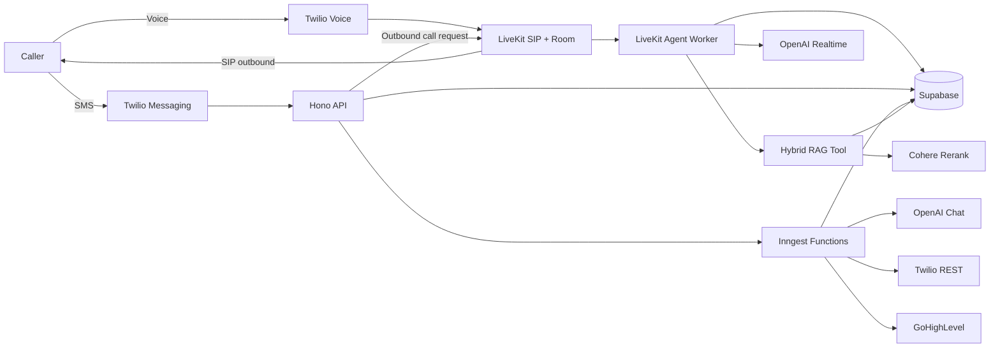

# voiceAgents v1

AI receptionist service for inbound and outbound voice plus SMS. v1 ships the shared tenant/contact conversation spine, hybrid methodology retrieval, SMS compliance, emergency escalation, call summaries, review requests, and GoHighLevel CRM sync.

## Architecture



Production RAG is hardcoded to `hybrid`. The page-index source remains in the repo for eval regression work, but `pnpm ingest`, voice, SMS, and admin search use hybrid only.

## Requirements

- Node.js 20 or newer
- pnpm 10.30.x
- Supabase with `pgcrypto` and `vector`
- LiveKit Cloud with SIP inbound routing
- Twilio account and messaging numbers
- OpenAI API key
- Cohere API key when hybrid rerank is enabled
- Inngest Cloud for production
- GoHighLevel private integration token per tenant when CRM sync is enabled

## Local Setup

```bash
python3 -m venv .venv
. .venv/bin/activate
pnpm install
cp .env.example .env.local
pnpm download-files
pnpm dev
```

`pnpm dev` starts the worker, API, and local Inngest dev server. The API listens on `API_PORT`, default `8787`.

## Environment

`RAG_WINNER` is required and must be `hybrid` for this v1 build. Leaving it unset causes startup validation to fail.

| Variable | Required By | Notes |
| --- | --- | --- |
| `RAG_WINNER` | both | Required. Set `hybrid`. |
| `LIVEKIT_URL` | worker | LiveKit websocket URL. |
| `LIVEKIT_API_KEY` | worker | LiveKit API key. |
| `LIVEKIT_API_SECRET` | worker | LiveKit API secret. |
| `LIVEKIT_AGENT_NAME` | worker | Dispatch name, default `inbound-agent`. |
| `LIVEKIT_SIP_OUTBOUND_TRUNK_ID` | api | Required for outbound voice calls. |
| `OPENAI_API_KEY` | both | Realtime, SMS, summaries, eval. |
| `OPENAI_SMS_MODEL` | api | Default SMS model. |
| `CALL_SUMMARY_MODEL` | api | Default summary model. |
| `CALL_SUMMARY_ENABLED` | api | Global summary toggle. |
| `SUPABASE_URL` | both | Supabase project URL. |
| `SUPABASE_SERVICE_ROLE_KEY` | both | Server service role key. |
| `ADMIN_API_KEY` | api | Shared secret for `/admin/*`. |
| `API_PORT` | api | Default `8787`. |
| `PUBLIC_BASE_URL` | api | Public API origin for Twilio signatures and admin links. |
| `TWILIO_ACCOUNT_SID` | api | Webhook account check and REST API. |
| `TWILIO_AUTH_TOKEN` | api | Signature validation and REST API. |
| `INNGEST_EVENT_KEY` | api, worker | Required in production. |
| `INNGEST_SIGNING_KEY` | api | Required in production. |
| `INNGEST_APP_ID` | both | Default `voice-agents`. |
| `SMS_HISTORY_WINDOW` | both | Shared context window. |
| `FOLLOWUP_SMS_ENABLED` | api | Global post-call follow-up toggle. |
| `OWNER_NOTIFY_ENABLED` | api | Global emergency owner SMS toggle. |
| `REVIEW_REQUESTS_ENABLED` | api | Global review request toggle. |
| `CRM_SYNC_ENABLED` | api | Global CRM sync toggle. |
| `CRM_CREDENTIAL_KEY` | api | 32-byte base64 AES key for CRM credentials. |
| `GHL_API_BASE_URL` | api | Defaults to `https://services.leadconnectorhq.com`. |
| `NO_TENANT_FALLBACK_MESSAGE` | worker | Spoken when no active tenant is found. |
| `LOG_LEVEL` | both | Pino log level. |
| `RAG_TOP_K` | both | Retrieval count cap. |
| `OPENAI_EMBED_MODEL` | ingest, api | Default `text-embedding-3-small`. |
| `HYBRID_HYDE_ENABLED` | api | Enables HyDE. |
| `HYBRID_HYDE_MODEL` | api | Default `gpt-4o-mini`. |
| `HYBRID_RERANK_ENABLED` | api | Enables Cohere rerank. |
| `COHERE_API_KEY` | api | Required when rerank is enabled. |
| `COHERE_RERANK_MODEL` | api | Default `rerank-v3.5`. |
| `PAGEINDEX_NAVIGATOR_MODEL` | eval | Retained for page-index eval only. |
| `PAGEINDEX_SUMMARY_MODEL` | eval | Retained for page-index eval only. |
| `PAGEINDEX_MAX_DEPTH` | eval | Retained for page-index eval only. |
| `PAGEINDEX_MAX_FANOUT` | eval | Retained for page-index eval only. |
| `EVAL_JUDGE_MODEL` | eval | Default `gpt-4o`. |
| `EVAL_DATASET_PATH` | eval | Optional JSONL eval dataset. |

## Database

Run raw SQL migrations in order:

1. `supabase/migrations/20260524000000_init_tenants.sql`
2. `supabase/migrations/20260525000000_sms_and_conversations.sql`
3. `supabase/migrations/20260526000000_library_rag.sql`
4. `supabase/migrations/20260527000000_v1_ship.sql`

Then run `supabase/seed.sql` for a starter tenant. v1 adds opt-outs, owner configs, review configs, CRM configs, review request tracking, escalations, call summaries, and CRM sync fields.

## RAG

Ingest methodology fixtures:

```bash
pnpm ingest library/fixtures/*.md
pnpm embed:reindex
```

Run evals:

```bash
pnpm eval
```

Eval code still supports both `hybrid` and `page_index`, but production retrieval does not switch pipelines.

## Admin API

All `/admin/*` routes require `x-api-key: $ADMIN_API_KEY`.

Tenant and conversation:

- `POST /admin/tenants`
- `GET /admin/tenants/:idOrSlug`
- `PATCH /admin/tenants/:idOrSlug/status`
- `PATCH /admin/tenants/:idOrSlug/voice-config`
- `GET/POST/PATCH /admin/tenants/:idOrSlug/sms-config`
- `POST /admin/tenants/:idOrSlug/phone-numbers`
- `DELETE /admin/tenants/:idOrSlug/phone-numbers/:phoneNumber`
- `GET /admin/tenants/:idOrSlug/conversations`
- `GET /admin/tenants/:idOrSlug/conversations/:conversationId/messages`
- `POST /admin/tenants/:idOrSlug/send-test-sms`
- `POST /admin/tenants/:idOrSlug/calls/outbound`

v1 operations:

- `GET/POST/PATCH /admin/tenants/:idOrSlug/owner-config`
- `GET/POST/PATCH /admin/tenants/:idOrSlug/review-config`
- `GET/POST/PATCH /admin/tenants/:idOrSlug/crm-config`
- `POST /admin/tenants/:idOrSlug/crm-config/test`
- `GET /admin/tenants/:idOrSlug/escalations`
- `GET /admin/tenants/:idOrSlug/dashboard`

Library and eval:

- `GET /admin/library/documents`
- `DELETE /admin/library/documents/:id`
- `POST /admin/library/search`
- `POST /admin/library/eval/run`
- `GET /admin/library/eval/runs`
- `GET /admin/library/eval/runs/:id`

Health:

- `GET /healthz`
- `GET /readyz`

`/readyz` checks Supabase, Twilio credentials, OpenAI reachability, Cohere reachability when rerank is enabled, and Inngest production config.

## SMS Compliance

Inbound SMS webhook handling checks compliance keywords before dispatching to Inngest or the LLM:

- `STOP`, `UNSUBSCRIBE`, `CANCEL`, `END`, `QUIT`, `STOPALL`: upsert `consumer_optouts`, send confirmation with `sendSmsRaw`, return empty TwiML.
- `START`, `UNSTOP`, `YES`: remove opt-out, send confirmation with `sendSmsRaw`, return empty TwiML.
- `HELP`: send tenant help text with `sendSmsRaw`, return empty TwiML.
- Existing opted-out contacts are ignored with empty TwiML.

All consumer outbound SMS goes through `sendSms`, which checks `consumer_optouts` and throws `OptedOutError` when blocked. The only bypasses are STOP/START/HELP confirmations and owner emergency notifications.

## v1 Workflows

- Inbound voice calls arrive through Twilio/LiveKit SIP and are handled by the LiveKit agent worker.
- Outbound voice calls are started by `POST /admin/tenants/:idOrSlug/calls/outbound`; the API creates a LiveKit room, dispatches the agent, and dials the contact through the configured outbound SIP trunk.
- `voice/call.completed` fans out to follow-up SMS, call summary, review request, and CRM sync.
- `summarize-call` writes `calls.summary`, `calls.key_facts`, and `calls.outcome`.
- `send-review-request` enforces tenant config, duration minimums, delay, and opt-out checks.
- `flag_emergency` is registered on voice and SMS agents. It inserts `escalations` and sends `escalation/triggered`.
- `notify-owner` sends the tenant owner an emergency SMS when configured.
- `sync-conversation-to-crm` upserts a GHL contact, appends transcript notes, and optionally creates a pipeline opportunity.

Message bodies, transcripts, owner phone numbers, decrypted CRM credentials, and other PII should stay out of info-level logs. Use debug-level logs for sensitive diagnostic content.

## Deployment

Fly.io deployment uses two apps from the same Docker image:

- `voice-agents-worker`: `node dist/agent.js start`
- `voice-agents-api`: `node dist/api.js`

See [deploy/README.md](deploy/README.md) for `flyctl launch`, secrets, deploy, custom domain, Inngest Cloud, Twilio webhook, and Supabase setup steps.

## Verification

```bash
pnpm install --frozen-lockfile
pnpm check
pnpm build
docker build .
```

For Fly config validation:

```bash
flyctl config validate --config deploy/fly.toml
flyctl config validate --config deploy/fly.api.toml
```
